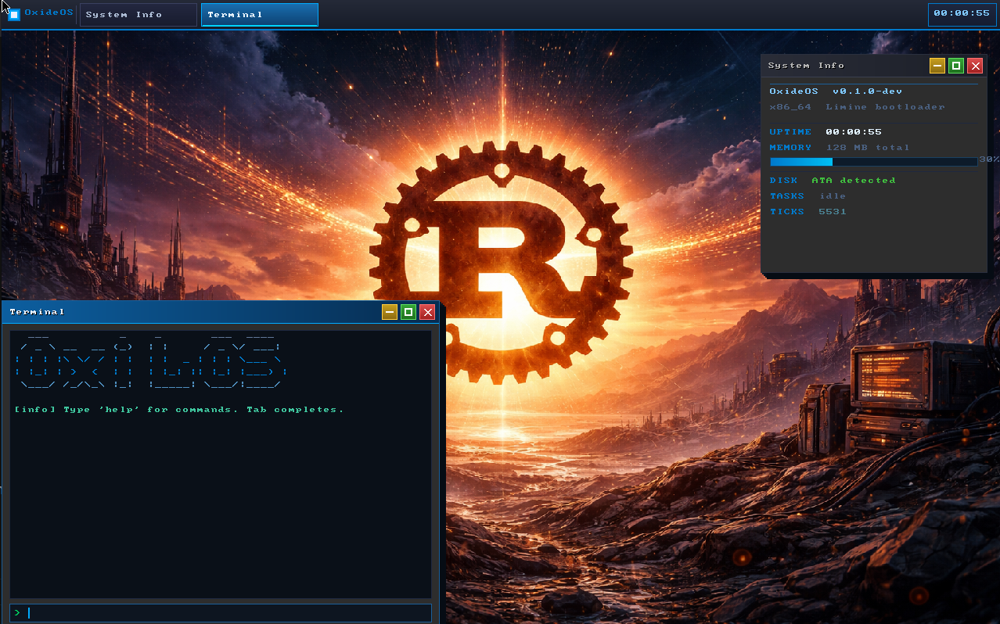

# OxideOS — Operating System in Rust

OxideOS is a hobby operating system written in Rust (`no_std`, x86_64) using the Limine bootloader. It boots on real hardware and in QEMU, runs a GUI with a window manager, supports networking, and can execute programs compiled with musl libc — including the Lua 5.4 interpreter.



---

## Capabilities at a Glance

### Boot & CPU
- Limine v9 bootloader — BIOS and UEFI
- GDT / TSS / IDT — full descriptor tables
- PIC (8259A), PIT at 100 Hz timer
- `int 0x80` legacy gate + `SYSCALL/SYSRET` fast path
- Ring 3 user mode, privilege separation

### Scheduler & Processes
- Preemptive round-robin scheduler (up to 8 tasks)
- `fork` / `exec` / `waitpid` / `exit` / `exit_group`
- ELF64 loader — `ET_EXEC` at 0x400000
- Per-process page tables with CR3 switching
- `brk` / `sbrk` heap per process
- `argv` / `argc` / `envp` on the user stack (System V AMD64 ABI)
- Signal handling — `sigaction`, `sigreturn`, trampoline page at 0x900000
- Process kill (`kill` with signal number)

### Memory Management
- Physical frame allocator + virtual paging
- Per-process CR3 (isolated address spaces)
- `mmap(MAP_ANONYMOUS|MAP_PRIVATE)` — anonymous zero pages
- Real `munmap` — unmaps PTEs, frees physical frames, per-task region tracking (32 regions)
- `mprotect` stub (returns success, no enforcement yet)

### Storage & Filesystems
- ATA PIO driver (port 0x1F0)
- MBR partition table parser
- **FAT16** — read / write / seek / truncate / rename / unlink / mkdir
- **ext2** — read-only
- **RamFS** — in-memory, writable
- VFS layer — `/dev/null`, `/dev/tty`

### Networking
- RTL8139 NIC driver
- smoltcp TCP/IP stack — TCP, UDP, ICMP, DHCP, ARP
- DHCP lease on boot
- `socket` / `bind` / `listen` / `accept` / `connect`
- `send` / `recv` / `sendto` / `recvfrom`

### GUI
- Double-buffered framebuffer (linear, RGBA)
- Window manager with Z-ordering and compositor IPC
- Per-window backing buffers (no flicker)
- Start menu
- PS/2 keyboard driver (pc-keyboard crate)
- PS/2 mouse driver

### IPC
- **Pipes** — `pipe` / `pipe2` / `dup2` (shell plumbing)
- **Message queues** — create / send / recv / destroy / blocking-recv / length
- **Shared memory** — `shmget` / `shmat` / `shmdt`

### Environment
- Per-kernel env store (up to 32 variables)
- `getenv` / `setenv` syscalls
- Shell `export VAR=val` and `$VAR` expansion
- Defaults: `PATH=/bin HOME=/ TERM=vt100 USER=oxide`

---

## Syscall Table

OxideOS uses the Linux x86-64 ABI syscall numbers so that programs compiled with musl libc work without any translation layer.

### Linux-compatible syscalls

| # | Name | # | Name | # | Name |
|---|------|---|------|---|------|
| 0 | read | 1 | write | 2 | open |
| 3 | close | 4 | stat | 5 | fstat |
| 6 | lstat | 7 | poll | 8 | lseek |
| 9 | mmap | 10 | mprotect | 11 | munmap |
| 12 | brk | 13 | rt_sigaction | 14 | rt_sigprocmask |
| 15 | rt_sigreturn | 16 | ioctl | 19 | readv |
| 22 | pipe | 25 | mremap | 29 | shmget |
| 30 | shmat | 33 | dup2 | 35 | nanosleep |
| 39 | getpid | 41 | socket | 42 | connect |
| 43 | accept | 44 | sendto | 45 | recvfrom |
| 49 | bind | 50 | listen | 57 | fork |
| 59 | execve | 60 | exit | 61 | wait4 |
| 62 | kill | 63 | uname | 67 | shmdt |
| 72 | fcntl | 76 | truncate | 78 | getdents64 |
| 79 | getcwd | 80 | chdir | 82 | rename |
| 83 | mkdir | 87 | unlink | 90 | chmod |
| 92 | chown | 96 | gettimeofday | 102 | getuid |
| 104 | getgid | 105 | setuid | 110 | getppid |
| 158 | arch_prctl | 186 | gettid | 202 | futex |
| 218 | set_tid_address | 228 | clock_gettime | 231 | exit_group |
| 293 | pipe2 | | | | |

### OxideOS-specific syscalls (≥ 400)

| # | Name | # | Name |
|---|------|---|------|
| 400 | print | 401 | getchar |
| 402 | get_system_info | 403 | getenv |
| 404 | setenv | 405 | exec_args |
| 406 | send (net) | 407 | recv (net) |
| 408 | close_socket | 415 | msgq_create |
| 416 | msgsnd | 417 | msgrcv |
| 418 | msgq_destroy | 419 | msgrcv_wait |
| 420 | msgq_len | 425 | gui_create |
| 426 | gui_destroy | 427 | gui_fill_rect |
| 428 | gui_draw_text | 429 | gui_present |
| 430 | gui_poll_event | 431 | gui_get_size |
| 432 | gui_blit_shm | 433 | install_query |
| 434 | install_begin | | |

---

## Userspace Programs

All programs are statically embedded in the kernel binary and extracted into RamFS at boot.

### Shell
| Program | Description |
|---------|-------------|
| `/bin/sh` | Shell with pipes (`\|`), `$VAR` expansion, `export`, I/O redirection, background jobs |

### Terminal & Editor
| Program | Description |
|---------|-------------|
| `/bin/terminal` | GUI terminal emulator (compositor window) |
| `/bin/edit` | nano-like text editor |

### Coreutils
| Program | Description |
|---------|-------------|
| `ls` | Directory listing |
| `cat` | Print file contents |
| `ps` | Process list |
| `cp` | Copy file |
| `mv` | Move / rename |
| `rm` | Remove file (`unlink`) |
| `mkdir` | Create directory |
| `pwd` | Print working directory |
| `echo` | Print arguments |
| `grep` | Substring search |
| `wc` | Word / line / byte count (`-l -w -c`) |
| `head` | First N lines (`-n N`) |
| `tail` | Last N lines (`-n N`) |
| `sort` | Lexicographic sort |
| `sleep` | Sleep N seconds |
| `kill` | Send signal to PID |
| `touch` | Create / update file |
| `true` / `false` | Exit 0 / 1 |

### Networking
| Program | Description |
|---------|-------------|
| `/bin/wget` | HTTP download |
| `/bin/nc` | Netcat — TCP listen/connect, UDP send/listen |

### GUI
| Program | Description |
|---------|-------------|
| `/bin/filemanager` | Graphical file manager (compositor window) |

### System
| Program | Description |
|---------|-------------|
| `/bin/install` | Live disk installer — detects blank ATA disk, writes OxideOS |

### musl libc Programs
| Program | Description |
|---------|-------------|
| `hello_musl` | Hello world via musl libc (tests printf, argv, getenv, getcwd) |
| `musl_test` | Tests malloc/free, clock_gettime, envp via musl libc |

### Open-Source Interpreters & Tools
| Program | Description |
|---------|-------------|
| `/bin/lua` | **Lua 5.4.7** — full interpreter, REPL and script execution, compiled with musl-gcc -static |
| `/bin/busybox` | **BusyBox 1.36.1** — 300+ Unix applets (ash shell, awk, sed, find, gzip, tar, …), compiled with musl-gcc -static |

---

## Open-Source Software Support

OxideOS uses the Linux x86-64 syscall ABI, making it possible to run programs compiled with musl libc without modification.

### musl libc
- Built from source at `/home/surendra/musl-src` → installed to `/home/surendra/musl-oxide/`
- `musl-gcc` wrapper at `/home/surendra/musl-oxide/bin/musl-gcc`
- Compile any C program: `musl-gcc -static -O2 -o myprogram myprogram.c`

### BusyBox 1.36.1
BusyBox is embedded and runnable from the shell:
```
$ busybox ls /
$ busybox ash
$ busybox awk 'BEGIN{print "hello"}'
$ busybox find / -name "*.elf"
```

### Lua 5.4.7
Lua is fully functional on OxideOS:
```
$ lua
Lua 5.4.7  Copyright (C) 1994-2024 Lua.org, PUC-Rio
> print("Hello from OxideOS!")
Hello from OxideOS!
> for i=1,5 do print(i*i) end
1
4
9
16
25
```
Built with: `make PLAT=linux CC="musl-gcc" MYCFLAGS="-static" MYLDFLAGS="-static" lua`

---

## Address Space Layout

| Region | Virtual Address | Notes |
|--------|----------------|-------|
| User code (ELF) | `0x0040_0000` | ET_EXEC load base |
| User stack top | `0x0080_0000` | 64 pages (256 KB) |
| Signal trampoline | `0x0090_0000` | Writable, executable |
| Heap base | `0x0100_0000` | brk/sbrk grows up |
| mmap anon base | `0x0800_0000` | MAP_ANONYMOUS grows up |
| Shared memory | `0x2000_0000` | SHM virtual base |
| HHDM offset | `0xFFFF_8000_0000_0000` | Direct-mapped physical memory |

---

## Quick Start (QEMU)

```bash
# 1. Install dependencies (Ubuntu/Debian)
sudo apt install build-essential qemu-system-x86 xorriso mtools dosfstools e2fsprogs nasm

# 2. Install Rust nightly
curl https://sh.rustup.rs -sSf | sh
rustup override set nightly

# 3. Build and run
make run-bios          # BIOS boot — ATA disk, serial output (best for dev)
make run-gui-x86_64    # UEFI boot — SDL window, GUI + mouse
```

---

## Build & Run Reference

### Build Commands

```bash
make                   # build ISO (oxide_os-x86_64.iso)
make kernel            # rebuild kernel only
make userspace         # rebuild userspace only
make clean             # remove ISO and build artefacts
make distclean         # remove everything including limine/ and ovmf/
```

### QEMU Run Targets

| Target | Machine | Display | Disk | Notes |
|--------|---------|---------|------|-------|
| `make run-bios` | `-M pc` (i440FX) | stdio serial | FAT16 on ATA | **Best for dev** |
| `make run-gui-x86_64` | q35 + UEFI | SDL window | FAT16 on ATA | Full GUI + mouse |
| `make run-x86_64` | q35 + UEFI | stdio serial | none | Headless UEFI |
| `make run-kvm-x86_64` | q35 + KVM | GTK | FAT16 | Hardware-accelerated |
| `make run-install-x86_64` | q35 + UEFI | SDL | install image | Test pre-built install |
| `make run-install-bios` | `-M pc` | stdio | install image | BIOS-boot install image |

### Disk Images

```bash
make disk              # create oxide_disk.img (4 MB FAT16, once)
make ext2-disk         # create oxide_ext2.img (32 MB ext2, optional)
make install-image     # build oxide_install.img (192 MB bootable)
make install-vdi       # convert to VirtualBox VDI
```

### Full Makefile Reference

| Target | Description |
|--------|-------------|
| `make` | Build ISO |
| `make kernel` | Rebuild kernel only |
| `make userspace` | Rebuild userspace only |
| `make run-bios` | QEMU BIOS boot, ATA disk, serial |
| `make run-gui-x86_64` | QEMU UEFI boot, SDL display |
| `make run-x86_64` | QEMU UEFI boot, serial only |
| `make run-kvm-x86_64` | QEMU with KVM acceleration |
| `make disk` | Create 4 MB FAT16 data disk |
| `make ext2-disk` | Create 32 MB ext2 secondary disk |
| `make install-image` | Build 192 MB bootable install image |
| `make install-vdi` | Convert install image to VirtualBox VDI |
| `make run-install-x86_64` | Boot install image in QEMU (UEFI) |
| `make run-install-bios` | Boot install image in QEMU (BIOS) |
| `make clean` | Remove ISO and build artefacts |
| `make clean-disk` | Remove oxide_disk.img |
| `make clean-install` | Remove install images |
| `make distclean` | Remove all build output |

---

## Persistent FAT16 Data Disk

The kernel mounts a FAT16 disk at `/disk/`. Create it once and it persists across boots:

```bash
make disk              # create oxide_disk.img (only needed once)
make run-bios          # ATA disk auto-detected
```

Files placed in `oxide_disk.img` are visible as `/disk/<name>`. To populate from the host:

```bash
sudo mount -o loop oxide_disk.img /mnt
sudo cp myfile.txt /mnt/
sudo umount /mnt
```

---

## Installation

OxideOS can be installed to a second disk — real hardware or VM.

### Method A — Pre-built image (simplest)

```bash
make install-image          # builds oxide_install.img (192 MB)
sudo ./install.sh /dev/sdX  # write to USB — replaces ALL data on /dev/sdX
```

Boot the USB on any x86_64 machine with UEFI or BIOS firmware.

#### VirtualBox

```bash
make install-vdi            # oxide_install.vdi
```

1. New VM → Type: `Other`, Version: `Other/Unknown (64-bit)`
2. RAM: 256 MB minimum
3. Hard Disk → *Use an existing virtual hard disk file* → select `oxide_install.vdi`
4. Settings → System → Enable EFI (optional — BIOS also works)
5. Start

### Method B — Live installer

Boot OxideOS from the ISO with a blank second disk, then run `/bin/install` inside the OS.

```bash
# 1. Create blank target disk
dd if=/dev/zero bs=1M count=256 of=install_target.img

# 2. Boot ISO with blank disk as second drive
qemu-system-x86_64 \
    -M pc -serial stdio \
    -cdrom oxide_os-x86_64.iso -boot d \
    -drive file=oxide_disk.img,format=raw,if=ide,index=0 \
    -drive file=install_target.img,format=raw,if=ide,index=1 \
    -m 2G -cpu max

# 3. Type 'install' in the shell, confirm with YES

# 4. Boot the installed disk
qemu-system-x86_64 \
    -M q35 -serial stdio \
    -drive if=pflash,unit=0,format=raw,file=ovmf/ovmf-code-x86_64.fd,readonly=on \
    -drive if=pflash,unit=1,format=raw,file=ovmf/ovmf-vars-x86_64.fd \
    -drive file=install_target.img,format=raw,if=ide,index=0 \
    -display sdl -m 2G -cpu max
```

#### What the installer writes

| Step | Action |
|------|--------|
| 1 | Format partition 1 (64 MB, FAT32) — EFI boot |
| 2 | Format partition 2 (64 MB, FAT16) — OxideOS data |
| 3 | Write EFI bootloader, Limine BIOS stage, boot config, kernel |
| 4 | Write MBR (written last — safe failure state) |

---

## Installed Disk Layout

```
oxide_install.img  (192 MB)
├── MBR  [LBA 0]
│   ├── Limine BIOS bootstrap
│   ├── Partition 1: EFI  (FAT32, 64 MB)
│   └── Partition 2: Data (FAT16, 64 MB)
│
├── Partition 1 — FAT32 (EFI System)
│   ├── EFI/BOOT/BOOTX64.EFI
│   ├── boot/limine/limine.conf
│   ├── boot/limine/limine-bios.sys
│   └── boot/kernel              ← full kernel + all userspace embedded
│
└── Partition 2 — FAT16 (user data, mounted as /disk/)
```

---

## ATA & QEMU Machine Types

OxideOS uses ATA PIO (port 0x1F0) requiring the legacy IDE controller:

| QEMU flag | Chipset | IDE | Use case |
|-----------|---------|-----|---------|
| `-M pc` | i440FX/PIIX4 | ✓ | Dev testing, BIOS boot |
| `-M q35` + UEFI | ICH9 | ✗ | GUI testing (RAM only) |
| `-M q35` + IDE drive | ICH9 | ✓ | Installed disk boot |

---

## WSL2 Notes

- SDL display requires an X server (VcXsrv, WSLg, or X410).
- KVM requires nested virtualisation: add `nestedVirtualization=true` to `~/.wslconfig` and restart WSL.
- All non-GUI targets (`run-bios`, `run-x86_64`) work without an X server.

---

## License

See [LICENSE](./LICENSE).
